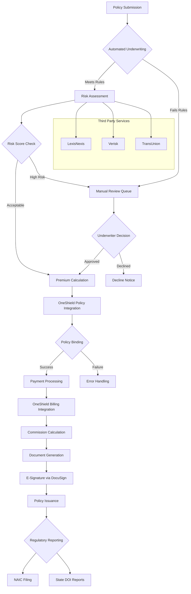
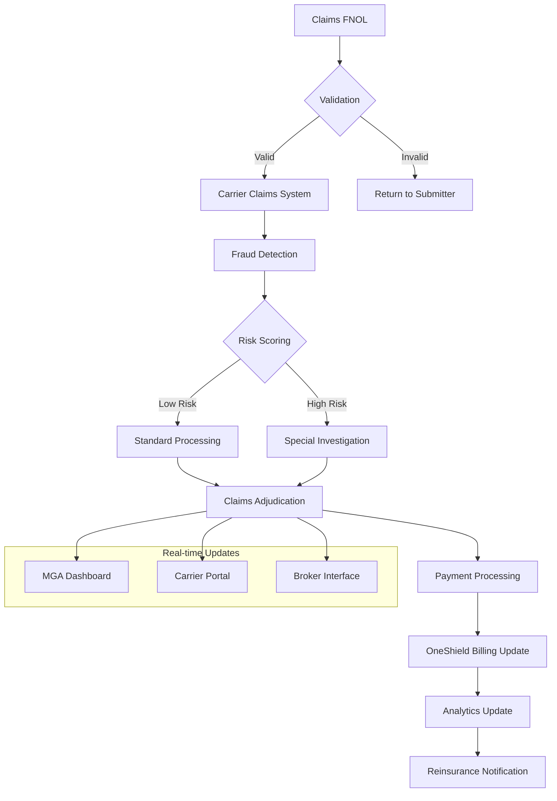
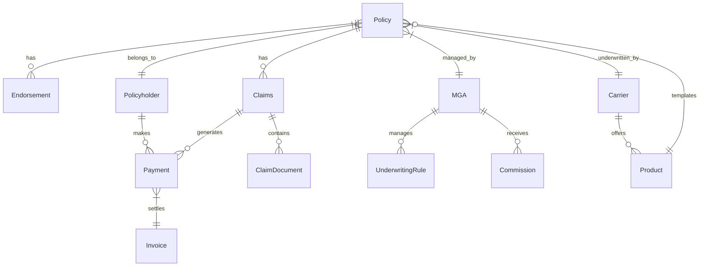
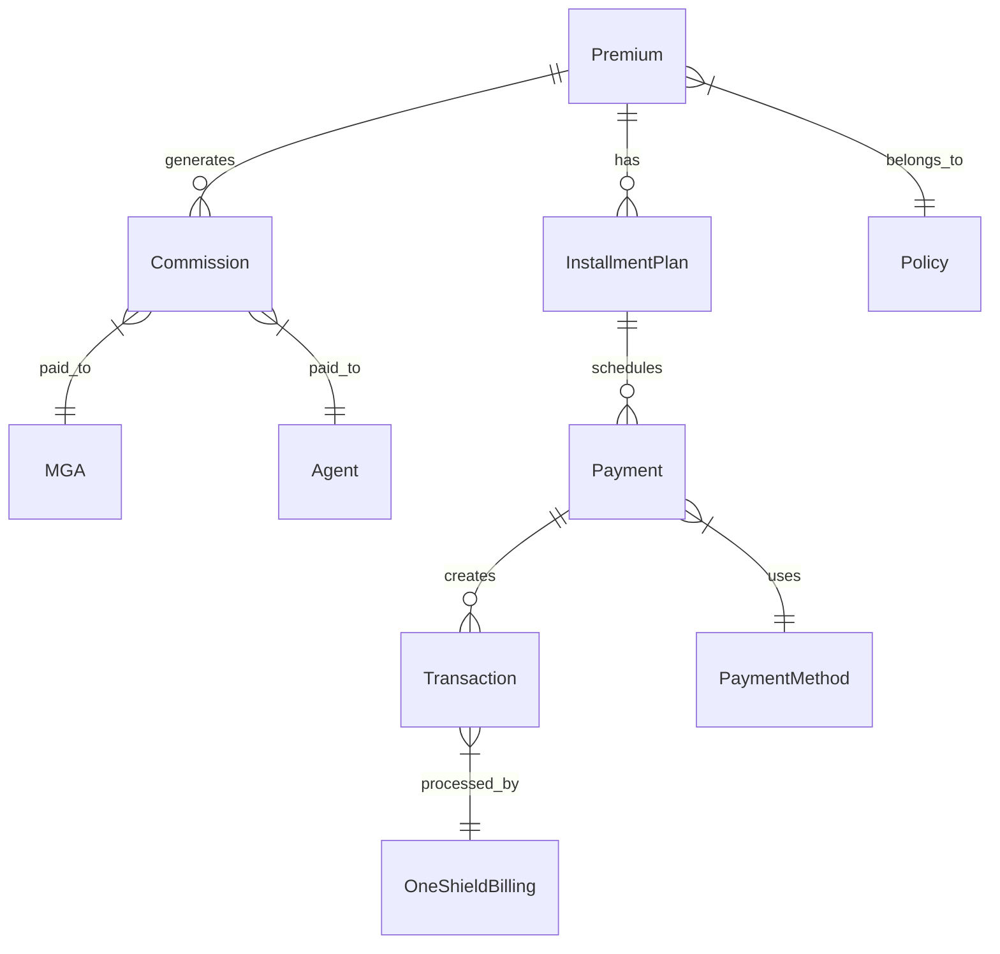
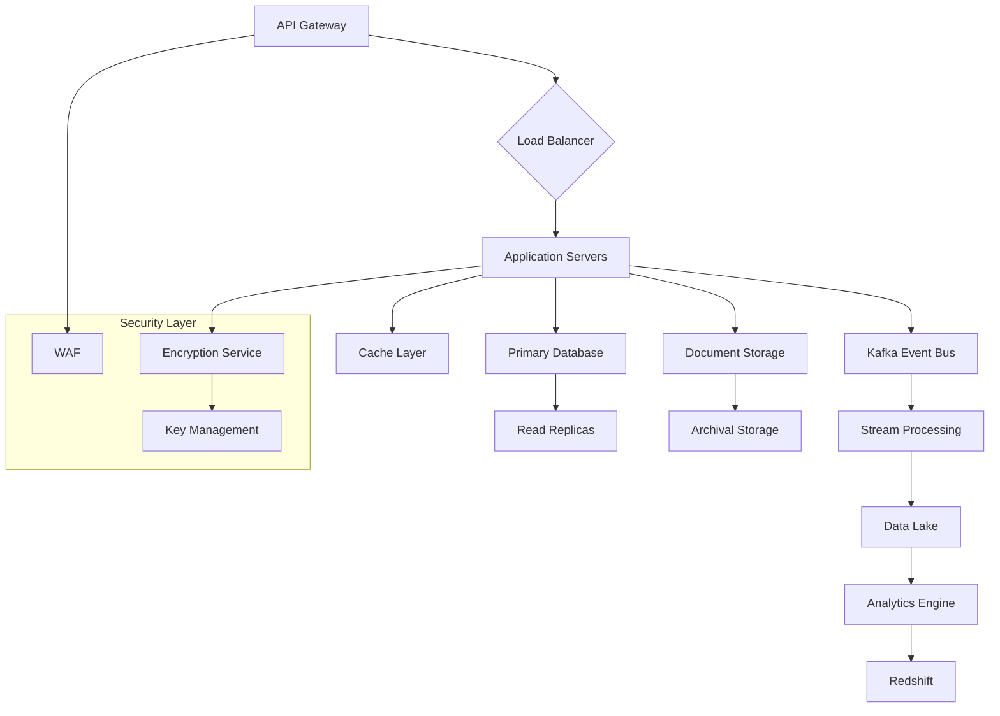
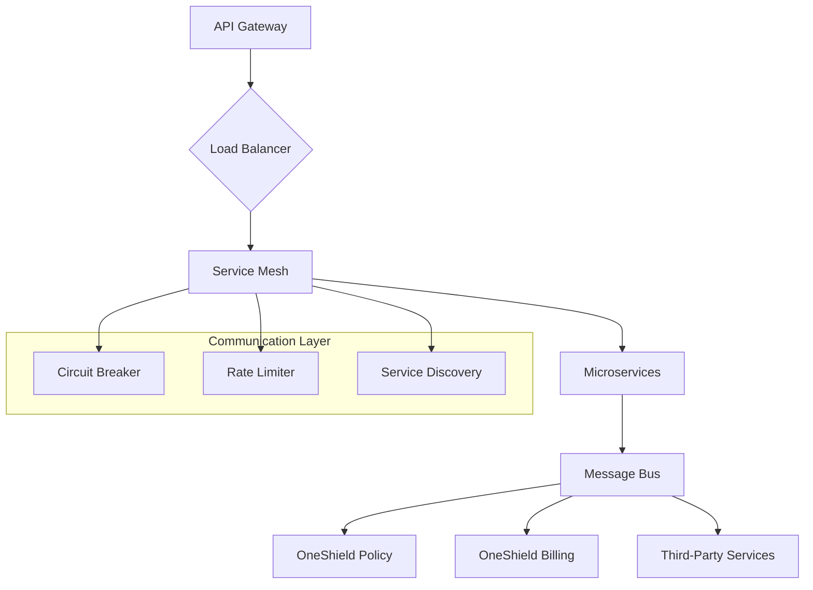

# Product Requirements Document (PRD)

# 1. INTRODUCTION

## 1.1 PURPOSE

This Software Requirements Specification (SRS) document provides a comprehensive description of the MGA Operating System (MGA OS), a cloud-based platform designed to support Managing General Agents. This document serves as the primary reference for technical teams, stakeholders, and development partners involved in the system's implementation. The intended audience includes:

- Development and QA teams
- System architects and designers
- Project managers and product owners
- Insurance carrier integration teams
- Compliance and security officers
- Third-party service providers

## 1.2 SCOPE

The MGA Operating System is a comprehensive cloud-based solution that enables seamless integration between MGAs and insurance carriers' enterprise systems. The system encompasses:

### Core Functionalities
- Policy administration and management
- Automated underwriting and risk assessment
- Billing and commission processing
- Claims and FNOL handling
- Compliance and regulatory reporting
- Data analytics and business intelligence

### Key Technical Components
- Cloud-native architecture deployed on major cloud platforms
- API-first design with RESTful endpoints
- Microservices-based architecture
- Event-driven system using Kafka
- Integration with OneShield Policy and Billing systems

### Benefits
- 40% reduction in underwriting turnaround time
- 70% automation of manual tasks
- 99.9% API uptime for carrier integrations
- Real-time regulatory compliance
- Enhanced data analytics and risk assessment capabilities

### Limitations
- Requires carrier system compatibility with REST APIs
- Limited to insurance products supported by integrated carrier systems
- Dependent on third-party services for fraud detection and risk analysis

# 2. PRODUCT DESCRIPTION

## 2.1 PRODUCT PERSPECTIVE

The MGA Operating System exists within a complex insurance technology ecosystem, interfacing with multiple enterprise systems and stakeholders:

- Operates as a cloud-native SaaS platform deployed on major cloud providers (AWS, Azure, GCP)
- Integrates directly with OneShield Policy and Billing systems as the primary carrier infrastructure
- Connects with third-party services for fraud detection, risk assessment, and compliance monitoring
- Functions as a middleware layer between MGAs and carrier enterprise systems
- Provides API endpoints for integration with agency management systems and broker platforms

## 2.2 PRODUCT FUNCTIONS

The system delivers the following core capabilities:

| Function Category | Key Features |
|------------------|--------------|
| Policy Administration | - New policy issuance and binding - Policy modifications and endorsements - Renewal processing - Document generation and management |
| Underwriting | - Automated risk assessment - Integration with third-party data providers - Rules engine implementation - AI-assisted decisioning |
| Financial Management | - Premium collection and reconciliation - Commission calculation and distribution - Integration with OneShield Billing - Payment scheduling and tracking |
| Compliance | - Regulatory reporting automation - Audit trail maintenance - E-signature integration - Data privacy controls |
| Analytics | - Real-time performance dashboards - Predictive modeling - Custom reporting capabilities - Business intelligence integration |

## 2.3 USER CHARACTERISTICS

| User Type | Characteristics | Technical Expertise |
|-----------|----------------|---------------------|
| MGA Underwriters | - Insurance domain expertise - Daily system users - Focus on risk assessment | Moderate |
| Carrier Integration Teams | - Technical background - API integration experience - System architecture knowledge | High |
| Compliance Officers | - Regulatory expertise - Periodic system access - Audit focus | Low to Moderate |
| Brokers/Agents | - Sales orientation - Customer-facing roles - Policy management needs | Low |
| Data Analysts | - Analytics expertise - Report generation focus - Data modeling skills | High |

## 2.4 CONSTRAINTS

1. Technical Constraints:
   - Must maintain compatibility with OneShield API specifications
   - Required to support legacy carrier systems
   - Cloud provider limitations and service quotas
   - Real-time processing requirements for underwriting decisions

2. Regulatory Constraints:
   - State-specific insurance regulations
   - NAIC compliance requirements
   - Data privacy laws (GDPR, CCPA)
   - Industry security standards (SOC 2, ISO 27001)

3. Operational Constraints:
   - 99.9% uptime requirement
   - Maximum 2-second response time for API calls
   - 24/7 availability requirement
   - Disaster recovery requirements

## 2.5 ASSUMPTIONS AND DEPENDENCIES

### Assumptions:
- Carrier systems maintain stable API endpoints
- Third-party data providers maintain service availability
- Users have basic computer literacy
- Internet connectivity is available at user locations
- Business rules remain relatively stable

### Dependencies:
- OneShield Policy and Billing system availability
- Third-party service providers:
  - LexisNexis
  - Verisk
  - TransUnion
  - DocuSign
- Cloud infrastructure services
- Regulatory reporting systems
- Payment processing services

# 3. PROCESS FLOWCHART

# 4. FUNCTIONAL REQUIREMENTS

## 4.1 Policy Administration Features

| ID | Description | Priority |
|---|-------------|----------|
| PA-01 | Create new insurance policies with automated validation against carrier guidelines | High |
| PA-02 | Process policy endorsements and modifications with real-time OneShield Policy updates | High |
| PA-03 | Manage policy renewals with automated underwriting checks and carrier approval workflows | High |
| PA-04 | Generate and store policy documents with version control and e-signature integration | Medium |
| PA-05 | Cancel policies with automated notification and compliance tracking | Medium |

## 4.2 Underwriting Features

| ID | Description | Priority |
|---|-------------|----------|
| UW-01 | Execute automated risk assessment using configurable rule engine | Critical |
| UW-02 | Integrate with third-party data providers (LexisNexis, Verisk, TransUnion) for risk validation | High |
| UW-03 | Implement AI-assisted underwriting decisions with machine learning models | Medium |
| UW-04 | Maintain underwriting audit trail with timestamped decisions and supporting documentation | High |
| UW-05 | Process referrals to manual underwriting queue with notification system | Medium |

## 4.3 Financial Management Features

| ID | Description | Priority |
|---|-------------|----------|
| FM-01 | Process premium payments with OneShield Billing integration | Critical |
| FM-02 | Calculate and distribute commissions based on carrier agreements | High |
| FM-03 | Generate financial reports and reconciliation statements | Medium |
| FM-04 | Handle premium financing arrangements and installment plans | Medium |
| FM-05 | Process policy refunds and cancellation returns | Medium |

## 4.4 Claims Management Features

| ID | Description | Priority |
|---|-------------|----------|
| CM-01 | Submit and track FNOL with carrier claims system integration | High |
| CM-02 | Implement automated fraud detection for claims processing | High |
| CM-03 | Provide real-time claims status updates to dashboard | Medium |
| CM-04 | Generate claims documentation and correspondence | Medium |
| CM-05 | Process claims payments through OneShield Billing | High |

## 4.5 Compliance Features

| ID | Description | Priority |
|---|-------------|----------|
| CF-01 | Generate automated regulatory reports for NAIC and state DOIs | Critical |
| CF-02 | Maintain compliance audit logs with encrypted storage | High |
| CF-03 | Implement e-signature workflows with DocuSign integration | High |
| CF-04 | Enforce data privacy controls (GDPR, CCPA) | Critical |
| CF-05 | Generate compliance attestation reports | Medium |

## 4.6 Analytics Features

| ID | Description | Priority |
|---|-------------|----------|
| AN-01 | Generate real-time performance dashboards | High |
| AN-02 | Implement predictive modeling for risk assessment | Medium |
| AN-03 | Create custom reports with API integration capabilities | Medium |
| AN-04 | Process and analyze claims data for trend identification | Medium |
| AN-05 | Generate reinsurance reports and notifications | High |

## 4.7 Integration Features

| ID | Description | Priority |
|---|-------------|----------|
| IN-01 | Maintain REST API endpoints for carrier system integration | Critical |
| IN-02 | Implement event-driven architecture using Kafka | High |
| IN-03 | Support third-party service provider integrations | High |
| IN-04 | Enable business intelligence tool connections (Looker, Power BI, Tableau) | Medium |
| IN-05 | Provide webhook support for real-time notifications | Medium |

# 5. NON-FUNCTIONAL REQUIREMENTS

## 5.1 Performance Requirements

| Metric | Requirement |
|--------|-------------|
| API Response Time | - 99th percentile < 2 seconds - Average response time < 500ms - Batch processing < 5 minutes |
| Throughput | - Support 1000 concurrent users - Process 10,000 API calls per minute - Handle 100,000 daily transactions |
| Resource Usage | - CPU utilization < 70% - Memory usage < 80% - Storage IOPS < 90% of provisioned |
| Database Performance | - Query response time < 100ms - Write operations < 50ms - Connection pool efficiency > 95% |

## 5.2 Safety Requirements

| Category | Requirement |
|----------|-------------|
| Data Backup | - Automated daily backups - Point-in-time recovery capability - 30-day backup retention |
| Disaster Recovery | - RPO < 15 minutes - RTO < 4 hours - Multi-region failover capability |
| System Monitoring | - Real-time error detection - Automated incident alerts - System health dashboards |
| Fault Tolerance | - Graceful degradation of services - Circuit breaker implementation - Automatic failover mechanisms |

## 5.3 Security Requirements

| Feature | Specification |
|---------|---------------|
| Authentication | - Multi-factor authentication (MFA) - SSO integration with SAML 2.0 - JWT token-based API authentication |
| Authorization | - Role-based access control (RBAC) - Attribute-based access control (ABAC) - Least privilege principle enforcement |
| Data Protection | - AES-256 encryption at rest - TLS 1.3 for data in transit - HSM for key management |
| Security Monitoring | - Real-time threat detection - SIEM integration - Regular penetration testing |

## 5.4 Quality Requirements

### 5.4.1 Availability
- System uptime: 99.9%
- Planned maintenance windows: < 4 hours monthly
- Service redundancy across multiple availability zones

### 5.4.2 Maintainability
- Microservices architecture with independent deployment
- Automated CI/CD pipelines
- Comprehensive API documentation
- Code coverage > 80%

### 5.4.3 Usability
- Web interface response time < 3 seconds
- Mobile-responsive design
- Accessibility compliance (WCAG 2.1)
- Maximum 3 clicks to reach any function

### 5.4.4 Scalability
- Horizontal scaling capability
- Auto-scaling based on load metrics
- Database sharding support
- Elastic resource allocation

### 5.4.5 Reliability
- Mean Time Between Failures (MTBF) > 720 hours
- Mean Time To Recovery (MTTR) < 30 minutes
- Error rate < 0.1% of transactions
- Data consistency guarantee

## 5.5 Compliance Requirements

| Standard | Requirements |
|----------|--------------|
| Data Privacy | - GDPR compliance - CCPA compliance - Data residency requirements - Privacy by design implementation |
| Industry Standards | - SOC 2 Type II certification - ISO 27001 compliance - NAIC data security model law - PCI DSS compliance for payments |
| Insurance Regulations | - State-specific DOI requirements - NAIC reporting standards - Insurance data retention policies - E-signature compliance (UETA/ESIGN) |
| Audit Requirements | - Complete audit trails - Immutable logging - Regular compliance reporting - Third-party audit support |

# 6. DATA REQUIREMENTS

## 6.1 DATA MODELS

### 6.1.1 Core Entity Relationships

### 6.1.2 Financial Data Model

## 6.2 DATA STORAGE

### 6.2.1 Storage Requirements

| Data Type | Storage Solution | Retention Period |
|-----------|-----------------|------------------|
| Policy Documents | S3 with Glacier transition | 7 years |
| Transaction Records | RDS with read replicas | 10 years |
| Audit Logs | CloudWatch Logs | 3 years |
| Analytics Data | Redshift | 5 years |
| Temporary Cache | Redis | 24 hours |

### 6.2.2 Backup and Recovery

| Component | Backup Frequency | Recovery Point | Recovery Time |
|-----------|-----------------|----------------|---------------|
| Policy Database | Continuous | 15 minutes | 4 hours |
| Document Storage | Daily | 24 hours | 8 hours |
| Analytics Data | Weekly | 7 days | 24 hours |
| Configuration Data | Daily | 24 hours | 2 hours |

## 6.3 DATA PROCESSING

### 6.3.1 Data Flow Architecture

### 6.3.2 Data Security Controls

| Security Layer | Implementation |
|----------------|----------------|
| Encryption at Rest | AES-256 with AWS KMS |
| Encryption in Transit | TLS 1.3 |
| Access Control | IAM + RBAC |
| Data Masking | PII/PHI field-level encryption |
| Audit | CloudTrail + CloudWatch |

### 6.3.3 Data Processing Requirements

| Process Type | SLA | Scaling Mechanism |
|-------------|-----|-------------------|
| Real-time Transactions | < 2 seconds | Horizontal pod autoscaling |
| Batch Processing | < 4 hours | EMR cluster scaling |
| Analytics Queries | < 30 seconds | Redshift concurrency scaling |
| Document Processing | < 5 minutes | Lambda concurrency |

# 7. EXTERNAL INTERFACES

## 7.1 USER INTERFACES

### 7.1.1 Web Application Interface

| Component | Requirements |
|-----------|--------------|
| Responsive Design | - Support for desktop (1920x1080) and mobile (360x640) resolutions - Bootstrap 5 framework implementation - Progressive Web App (PWA) capabilities |
| Accessibility | - WCAG 2.1 Level AA compliance - Screen reader compatibility - Keyboard navigation support |
| Browser Support | - Chrome 90+ - Firefox 88+ - Safari 14+ - Edge 90+ |

### 7.1.2 Portal-Specific Requirements

| Portal Type | Key Features |
|------------|--------------|
| MGA Dashboard | - Real-time policy status updates - Underwriting queue management - Analytics visualization - Document management interface |
| Carrier Portal | - Policy approval workflows - Risk assessment tools - Commission management - Compliance reporting |
| Agent Interface | - Quote generation forms - Policy submission wizard - Claims tracking dashboard - Document upload interface |

## 7.2 HARDWARE INTERFACES

### 7.2.1 Cloud Infrastructure

| Component | Specification |
|-----------|--------------|
| Load Balancers | - AWS Application Load Balancer - Health check endpoints - SSL termination |
| Storage Devices | - AWS S3 for document storage - EBS volumes for database storage - Instance storage for temporary data |
| Network Devices | - VPC configuration - NAT gateways - VPN endpoints for carrier connectivity |

## 7.3 SOFTWARE INTERFACES

### 7.3.1 Enterprise System Integration

| System | Integration Specifications |
|--------|---------------------------|
| OneShield Policy | - REST API endpoints - JWT authentication - XML/JSON payload support - Rate limiting: 1000 requests/minute |
| OneShield Billing | - SOAP/REST hybrid interface - Mutual TLS authentication - ISO 8583 financial messages - 2-second response SLA |
| Document Management | - S3 API integration - DocuSign REST API v2.1 - PDF generation services - Version control system |

### 7.3.2 Third-Party Services

| Service | Integration Requirements |
|---------|------------------------|
| LexisNexis | - REST API v3.0 - OAuth 2.0 authentication - XML response parsing - 500ms timeout threshold |
| Verisk | - SOAP API integration - WS-Security headers - ISO 20022 message format - Batch processing support |
| TransUnion | - GraphQL API endpoints - API key authentication - JSON-LD response format - Rate limit: 100 requests/second |

## 7.4 COMMUNICATION INTERFACES

### 7.4.1 Network Protocols

| Protocol | Specifications |
|----------|---------------|
| HTTP/HTTPS | - TLS 1.3 required - Certificate pinning - HTTP/2 support - REST architectural style |
| Message Queue | - Apache Kafka 2.8+ - Topic-based pub/sub - At-least-once delivery - Message persistence |
| WebSocket | - WSS protocol required - Ping/pong heartbeat - Auto-reconnection - Binary message support |

### 7.4.2 Data Exchange Formats

| Format | Requirements |
|--------|--------------|
| JSON | - Schema validation - Compression support - UTF-8 encoding - Maximum payload size: 5MB |
| XML | - XSD validation - XSLT transformation support - Namespace compliance - Entity encoding |
| Binary | - Protocol Buffers 3.0 - Avro serialization - Compression algorithms - Checksum validation |

### 7.4.3 Integration Patterns

# 8. APPENDICES

## 8.1 GLOSSARY

| Term | Definition |
|------|------------|
| Managing General Agent (MGA) | An insurance professional or firm with authority from an insurer to underwrite, bind coverage, and administer programs |
| Endorsement | A written document attached to an insurance policy that modifies the policy's coverage, terms, or conditions |
| First Notice of Loss (FNOL) | The initial report made to an insurance company following a loss, theft, or damage of an insured asset |
| Premium | The amount paid by a policyholder for insurance coverage |
| Underwriting | The process of evaluating, defining, and pricing insurance risks |
| Binding | The process of putting an insurance policy into effect |
| E-signature | Electronic authentication method used to confirm the identity of a signatory and their intent |
| Point-in-time Recovery | The ability to restore data to a specific moment in time |

## 8.2 ACRONYMS

| Acronym | Definition |
|---------|------------|
| API | Application Programming Interface |
| CCPA | California Consumer Privacy Act |
| DOI | Department of Insurance |
| FNOL | First Notice of Loss |
| GDPR | General Data Protection Regulation |
| HSM | Hardware Security Module |
| IAM | Identity and Access Management |
| IOPS | Input/Output Operations Per Second |
| JWT | JSON Web Token |
| MFA | Multi-Factor Authentication |
| MTBF | Mean Time Between Failures |
| MTTR | Mean Time To Recovery |
| NAIC | National Association of Insurance Commissioners |
| PCI DSS | Payment Card Industry Data Security Standard |
| PHI | Protected Health Information |
| PII | Personally Identifiable Information |
| RBAC | Role-Based Access Control |
| RPO | Recovery Point Objective |
| RTO | Recovery Time Objective |
| SAML | Security Assertion Markup Language |
| SIEM | Security Information and Event Management |
| SOC | System and Organization Controls |
| SSO | Single Sign-On |
| UETA | Uniform Electronic Transactions Act |
| WAF | Web Application Firewall |
| WCAG | Web Content Accessibility Guidelines |

## 8.3 ADDITIONAL REFERENCES

| Category | Reference |
|----------|-----------|
| API Standards | - OpenAPI Specification 3.0 - REST API Design Rulebook - JSON:API Specification |
| Security Standards | - NIST Cybersecurity Framework - ISO 27001:2013 - OWASP Top 10 2021 |
| Insurance Regulations | - NAIC Model Laws - State-specific Insurance Codes - Federal Insurance Regulations |
| Technical Documentation | - OneShield API Documentation - Kafka Documentation - AWS Well-Architected Framework |
| Industry Guidelines | - ACORD Standards - Insurance Data Security Model Law - Electronic Signature Guidelines |