# Technical Specifications

# 1. INTRODUCTION

## 1.1 EXECUTIVE SUMMARY

The MGA Operating System (MGA OS) is a cloud-based, API-driven platform designed to modernize and streamline operations between Managing General Agents (MGAs) and insurance carriers. The system addresses the critical challenge of fragmented policy administration, manual underwriting processes, and complex compliance requirements in the MGA-carrier relationship. By providing seamless integration with OneShield Policy and Billing systems, automated underwriting workflows, and real-time data exchange capabilities, the platform enables MGAs to reduce operational costs by 70% while maintaining 99.9% uptime for carrier integrations.

Primary stakeholders include MGA underwriting teams, insurance carriers' integration teams, compliance officers, brokers, and data analysts. The system is expected to reduce underwriting turnaround time by 40% while ensuring continuous regulatory compliance and enhanced risk assessment capabilities.

## 1.2 SYSTEM OVERVIEW

### Project Context

| Aspect | Description |
|--------|-------------|
| Business Context | Cloud-native solution positioning as middleware between MGAs and carrier enterprise systems |
| Current Limitations | Manual processes, siloed systems, delayed carrier communications, compliance gaps |
| Enterprise Integration | Direct integration with OneShield ecosystem, third-party data providers, and regulatory systems |

### High-Level Description

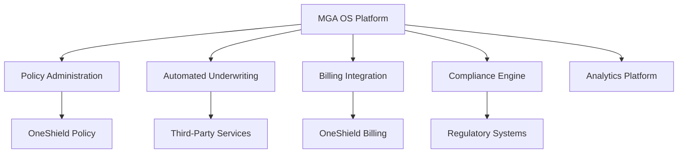

### Success Criteria

| Category | Target Metrics |
|----------|---------------|
| Performance | - API uptime: 99.9%<br>- Response time: < 2 seconds<br>- Transaction throughput: 10,000/minute |
| Business Impact | - 40% reduction in underwriting time<br>- 70% automation of manual tasks<br>- 90% user satisfaction rate |
| Integration | - 99.9% successful carrier system synchronization<br>- Real-time data exchange<br>- Zero data loss in transmission |

## 1.3 SCOPE

### In-Scope Elements

| Category | Components |
|----------|------------|
| Core Features | - Policy administration and binding<br>- Automated underwriting engine<br>- Premium/commission processing<br>- Claims integration<br>- Compliance reporting<br>- Analytics dashboard |
| Implementation | - Cloud deployment (AWS/Azure/GCP)<br>- API-first architecture<br>- Microservices implementation<br>- Event-driven processing |
| User Groups | - MGA underwriters<br>- Carrier integration teams<br>- Compliance officers<br>- Brokers/agents<br>- Data analysts |
| Geographic Coverage | - All U.S. states and territories<br>- International expansion ready |

### Out-of-Scope Elements

- Direct consumer-facing portals
- Legacy system maintenance
- Non-insurance financial products
- Manual claims processing
- Custom hardware requirements
- Offline processing capabilities
- Direct reinsurance treaty management
- Third-party policy administration systems beyond OneShield

# 2. SYSTEM ARCHITECTURE

## 2.1 High-Level Architecture

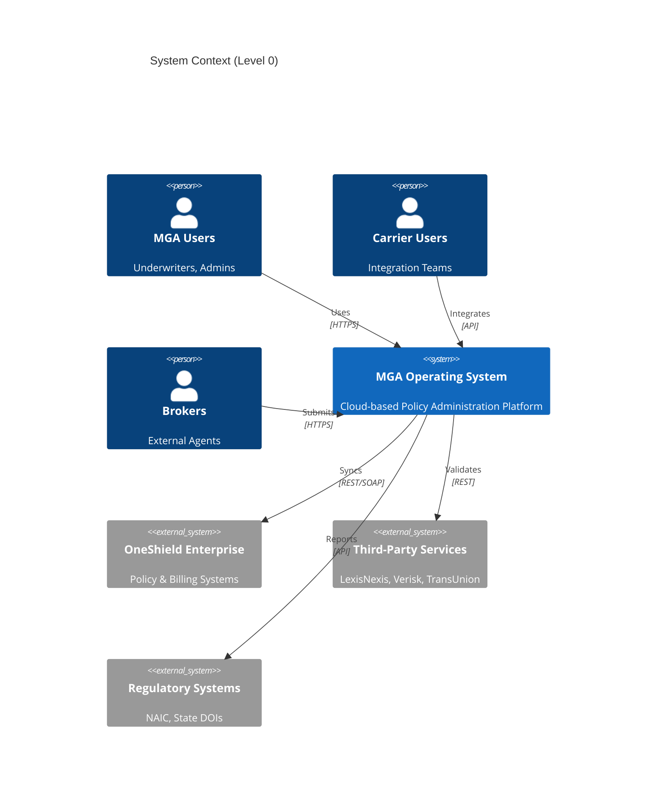

```mermaid
C4Container
    title Container Diagram (Level 1)
    
    Container(api, "API Gateway", "AWS API Gateway", "Entry point for all API requests")
    Container(web, "Web Application", "React/Node.js", "User interface")
    Container(auth, "Auth Service", "OAuth/OIDC", "Authentication & authorization")
    
    Container_Boundary(core, "Core Services") {
        Container(policy, "Policy Service", "Java/Spring", "Policy management")
        Container(underwriting, "Underwriting Service", "Python/FastAPI", "Risk assessment")
        Container(billing, "Billing Service", "Java/Spring", "Financial operations")
        Container(compliance, "Compliance Service", "Go", "Regulatory reporting")
    }
    
    ContainerDb(policydb, "Policy Store", "PostgreSQL", "Policy data")
    ContainerDb(eventstore, "Event Store", "Kafka", "Event streaming")
    ContainerDb(cache, "Cache", "Redis", "Distributed cache")
    
    Rel(api, auth, "Authenticates", "REST")
    Rel(api, core, "Routes", "REST")
    Rel(core, policydb, "Persists", "SQL")
    Rel(core, eventstore, "Publishes", "Events")
    Rel(core, cache, "Caches", "Redis Protocol")
```

## 2.2 Component Details

### 2.2.1 Core Service Components

| Component | Details |
|-----------|---------|
| API Gateway | - AWS API Gateway with Lambda authorizers<br>- Rate limiting: 10,000 requests/minute<br>- Request validation and transformation<br>- API versioning and documentation |
| Policy Service | - Spring Boot microservice<br>- REST API endpoints<br>- Event sourcing pattern<br>- PostgreSQL persistence |
| Underwriting Service | - FastAPI application<br>- ML model integration<br>- Async processing<br>- Redis caching |
| Billing Service | - Spring Boot microservice<br>- OneShield Billing integration<br>- Transaction management<br>- Event publishing |
| Compliance Service | - Go microservice<br>- Regulatory reporting<br>- Document generation<br>- Audit logging |

### 2.2.2 Infrastructure Components

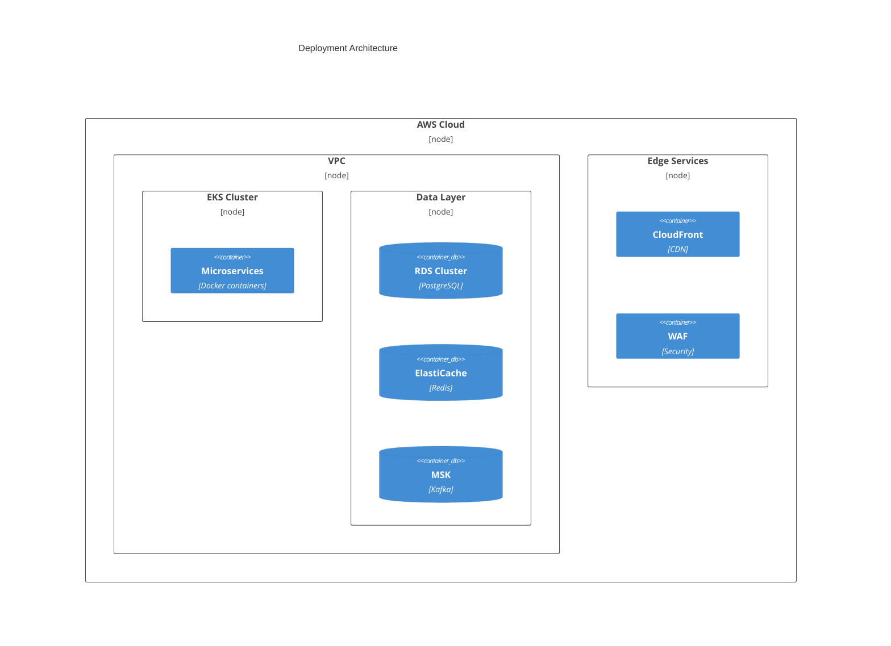

## 2.3 Technical Decisions

### 2.3.1 Architecture Patterns

| Pattern | Justification |
|---------|---------------|
| Microservices | - Independent scaling and deployment<br>- Technology flexibility<br>- Fault isolation<br>- Team autonomy |
| Event-Driven | - Loose coupling<br>- Async processing<br>- Audit trail<br>- Event sourcing capabilities |
| API-First | - Integration flexibility<br>- Contract-driven development<br>- Version control<br>- Documentation automation |

### 2.3.2 Data Flow Architecture

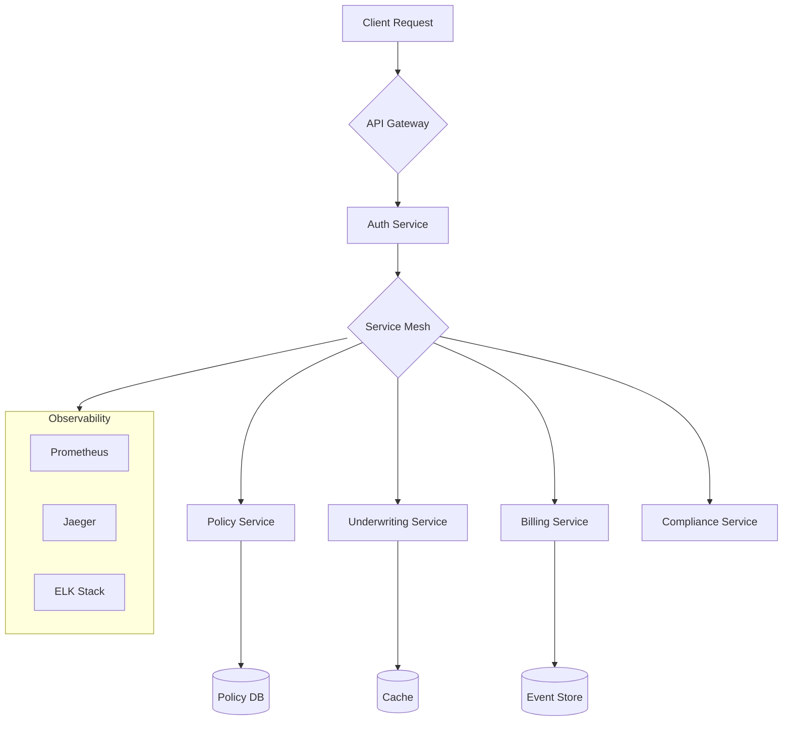

## 2.4 Cross-Cutting Concerns

### 2.4.1 System Monitoring

| Component | Implementation |
|-----------|---------------|
| Metrics | - Prometheus for metrics collection<br>- Grafana dashboards<br>- Custom alerting rules<br>- SLO/SLA monitoring |
| Tracing | - Jaeger distributed tracing<br>- OpenTelemetry instrumentation<br>- Trace sampling<br>- Performance analysis |
| Logging | - ELK Stack implementation<br>- Structured logging<br>- Log aggregation<br>- Retention policies |

### 2.4.2 Security Architecture

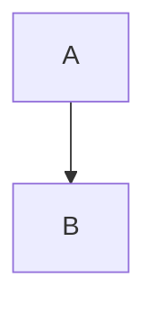

# 3. SYSTEM COMPONENTS ARCHITECTURE

## 3.1 USER INTERFACE DESIGN

### 3.1.1 Design Specifications

| Category | Requirements |
|----------|--------------|
| Visual Hierarchy | - F-pattern layout for dashboards<br>- Z-pattern for landing pages<br>- Card-based component grouping<br>- Consistent typography scale |
| Design System | - Material Design 3.0 components<br>- Custom MGA OS theme tokens<br>- Atomic design principles<br>- Standardized spacing units |
| Responsive Design | - Mobile-first approach<br>- Breakpoints: 320px, 768px, 1024px, 1440px<br>- Fluid typography<br>- Container queries |
| Accessibility | - WCAG 2.1 Level AA compliance<br>- ARIA landmarks<br>- Focus management<br>- Screen reader optimization |
| Browser Support | - Chrome 90+<br>- Firefox 88+<br>- Safari 14+<br>- Edge 90+ |

### 3.1.2 Interface Elements

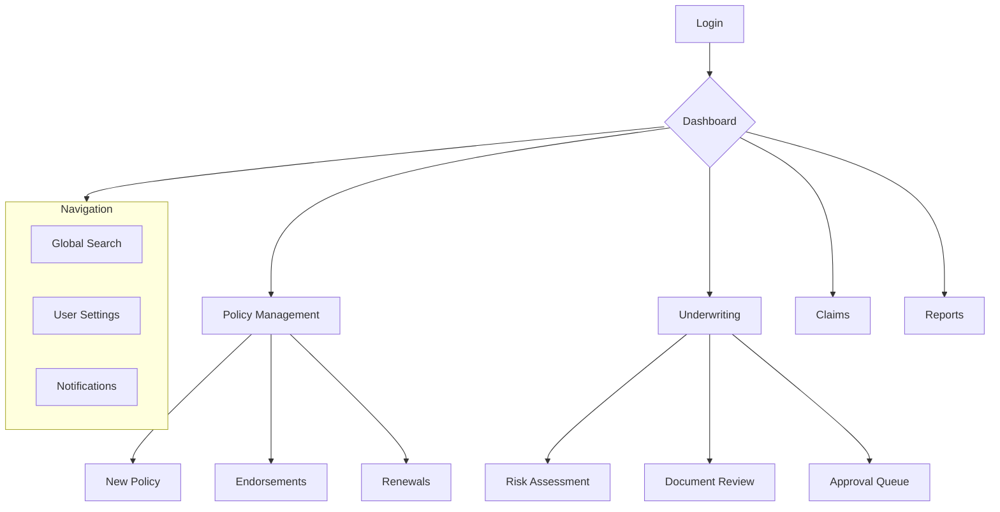

### 3.1.3 Critical User Flows

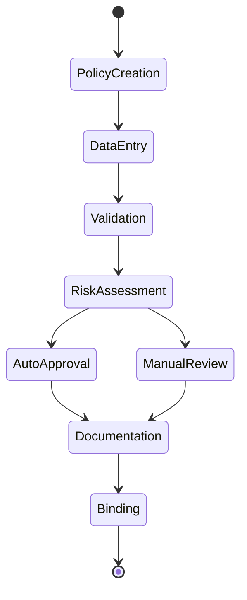

## 3.2 DATABASE DESIGN

### 3.2.1 Schema Design

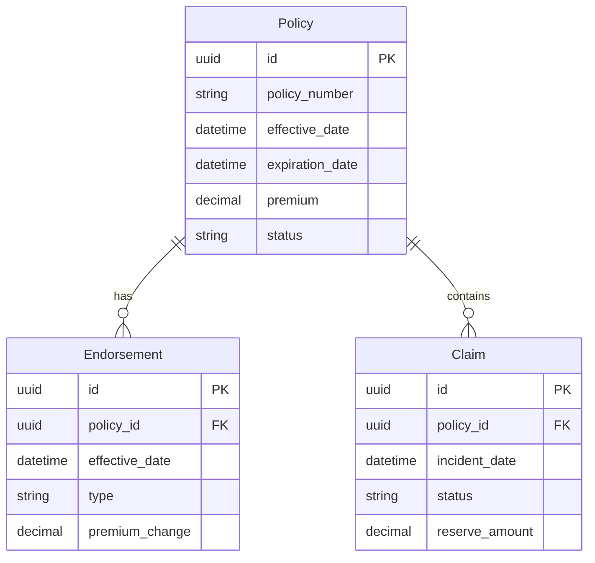

### 3.2.2 Data Management Strategy

| Component | Implementation |
|-----------|---------------|
| Primary Storage | - PostgreSQL 14+ cluster<br>- Multi-AZ deployment<br>- Read replicas for reporting |
| Document Store | - MongoDB for flexible schemas<br>- Sharded collections<br>- Time-series optimization |
| Cache Layer | - Redis cluster<br>- Write-through caching<br>- 15-minute TTL default |
| Event Store | - Apache Kafka<br>- Topic-based partitioning<br>- 30-day retention |

### 3.2.3 Performance Architecture

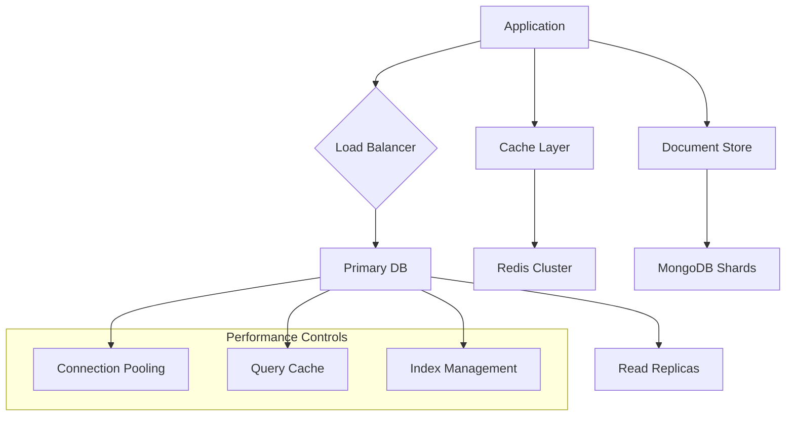

## 3.3 API DESIGN

### 3.3.1 API Architecture

| Component | Specification |
|-----------|--------------|
| Protocol | - REST over HTTPS<br>- GraphQL for complex queries<br>- WebSocket for real-time updates |
| Authentication | - OAuth 2.0 with JWT<br>- Mutual TLS for service-to-service<br>- API keys for third-party access |
| Rate Limiting | - 1000 requests/minute per client<br>- Token bucket algorithm<br>- Retry-After headers |
| Versioning | - URI versioning (v1, v2)<br>- Semantic versioning<br>- Deprecation notices |

### 3.3.2 Interface Specifications

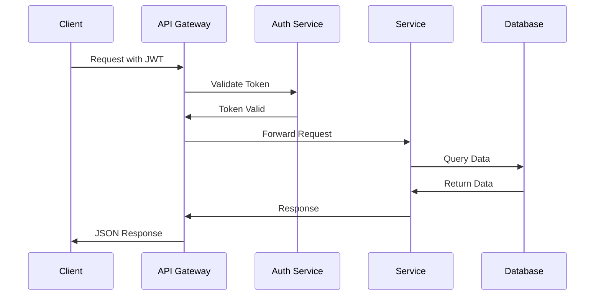

### 3.3.3 Integration Patterns

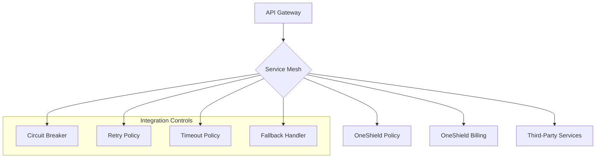

# 4. TECHNOLOGY STACK

## 4.1 PROGRAMMING LANGUAGES

| Platform/Component | Language & Version | Justification |
|-------------------|-------------------|----------------|
| Backend Services | Java 17 LTS | - Enterprise support & stability<br>- Strong typing for complex domain models<br>- OneShield compatibility<br>- Rich ecosystem for insurance platforms |
| Underwriting Engine | Python 3.11 | - ML/AI capabilities<br>- Data processing libraries<br>- Risk modeling support<br>- Integration flexibility |
| Frontend | TypeScript 5.0 | - Type safety for complex UIs<br>- Enhanced developer productivity<br>- Better maintainability<br>- React ecosystem compatibility |
| Infrastructure | Go 1.20 | - High-performance microservices<br>- Excellent concurrency<br>- Low resource footprint<br>- Strong DevOps tooling |

## 4.2 FRAMEWORKS & LIBRARIES

### Backend Frameworks

| Framework | Version | Purpose |
|-----------|---------|----------|
| Spring Boot | 3.1.x | - Core business services<br>- REST API development<br>- Enterprise integration<br>- Transaction management |
| FastAPI | 0.100.x | - ML model serving<br>- Async processing<br>- API documentation<br>- Performance optimization |
| Gin | 1.9.x | - High-performance services<br>- Middleware support<br>- Routing efficiency |

### Frontend Frameworks

| Framework | Version | Purpose |
|-----------|---------|----------|
| React | 18.2.x | - Component-based UI<br>- Virtual DOM efficiency<br>- Large ecosystem<br>- Enterprise adoption |
| Material UI | 5.14.x | - Consistent design system<br>- Accessibility support<br>- Responsive components |
| Redux Toolkit | 1.9.x | - State management<br>- Side effect handling<br>- Developer tooling |

## 4.3 DATABASES & STORAGE

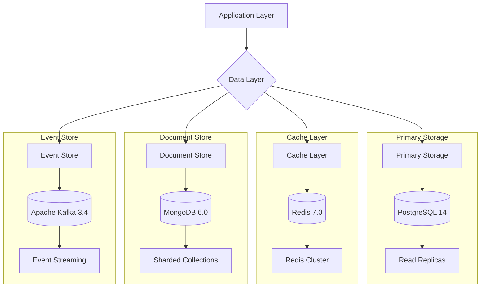

## 4.4 THIRD-PARTY SERVICES

| Category | Service | Purpose |
|----------|---------|----------|
| Authentication | Okta | - SSO integration<br>- MFA support<br>- Directory services |
| Document Processing | DocuSign | - E-signature workflows<br>- Document templates<br>- Audit trails |
| Monitoring | Datadog | - APM<br>- Log aggregation<br>- Infrastructure monitoring |
| Cloud Infrastructure | AWS | - Global availability<br>- Managed services<br>- Enterprise compliance |

## 4.5 DEVELOPMENT & DEPLOYMENT

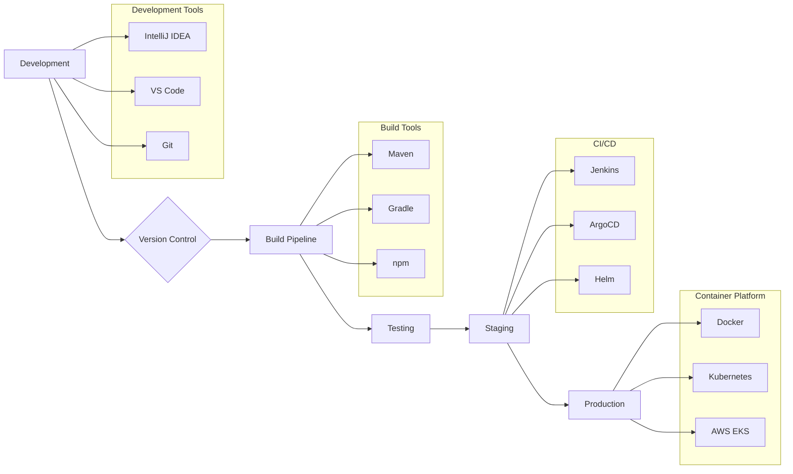

### Development Environment

| Tool | Version | Purpose |
|------|---------|----------|
| Docker | 24.0.x | - Container runtime<br>- Local development<br>- Build system |
| Kubernetes | 1.27.x | - Container orchestration<br>- Service deployment<br>- Scaling management |
| Terraform | 1.5.x | - Infrastructure as code<br>- Cloud provisioning<br>- Environment parity |
| Jenkins | 2.401.x | - CI/CD pipeline<br>- Automated testing<br>- Deployment automation |

# 5. SYSTEM DESIGN

## 5.1 USER INTERFACE DESIGN

### 5.1.1 Layout Structure

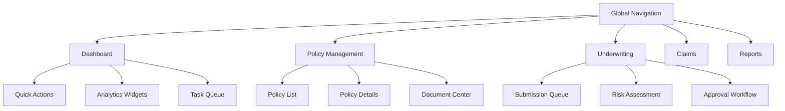

### 5.1.2 Component Specifications

| Component | Specifications |
|-----------|---------------|
| Global Navigation | - Material UI AppBar<br>- Responsive drawer menu<br>- Quick search integration<br>- User settings dropdown |
| Dashboard | - 4-column grid layout<br>- Draggable widgets<br>- Real-time updates<br>- Customizable views |
| Policy Management | - Data grid with filtering<br>- Split-pane details view<br>- Document preview panel<br>- Action toolbar |
| Underwriting | - Kanban board layout<br>- Risk scoring cards<br>- Decision workflow wizard<br>- Integration panels |

## 5.2 DATABASE DESIGN

### 5.2.1 Core Schema

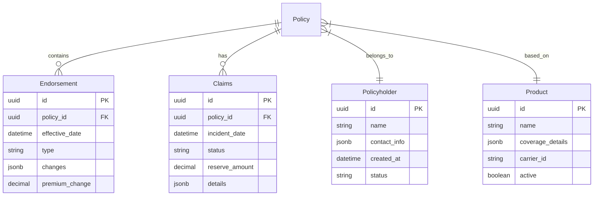

### 5.2.2 Storage Strategy

| Data Type | Storage Solution | Specifications |
|-----------|-----------------|----------------|
| Transactional Data | PostgreSQL 14 | - Multi-AZ deployment<br>- Read replicas for reporting<br>- Partitioning by date<br>- JSONB for flexible schemas |
| Document Storage | MongoDB 6.0 | - Sharded collections<br>- WiredTiger storage engine<br>- Time-series collections<br>- Compound indexes |
| Cache Layer | Redis 7.0 | - Cluster mode enabled<br>- AOF persistence<br>- LRU eviction<br>- Pub/sub channels |

## 5.3 API DESIGN

### 5.3.1 REST API Structure

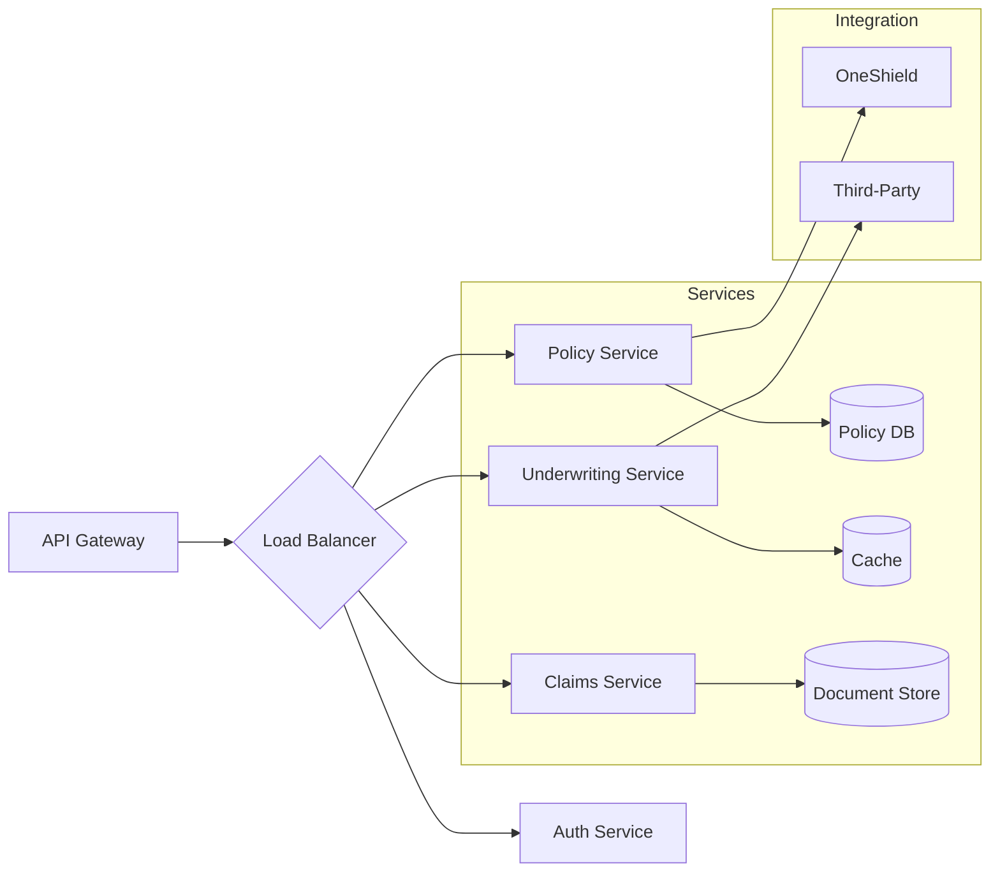

### 5.3.2 API Endpoints

| Service | Endpoint | Method | Purpose |
|---------|----------|--------|----------|
| Policy | /api/v1/policies | POST | Create new policy |
| Policy | /api/v1/policies/{id} | GET | Retrieve policy details |
| Underwriting | /api/v1/risks/assess | POST | Perform risk assessment |
| Claims | /api/v1/claims | POST | Submit new claim |
| Documents | /api/v1/documents | PUT | Upload policy document |

### 5.3.3 Integration Patterns

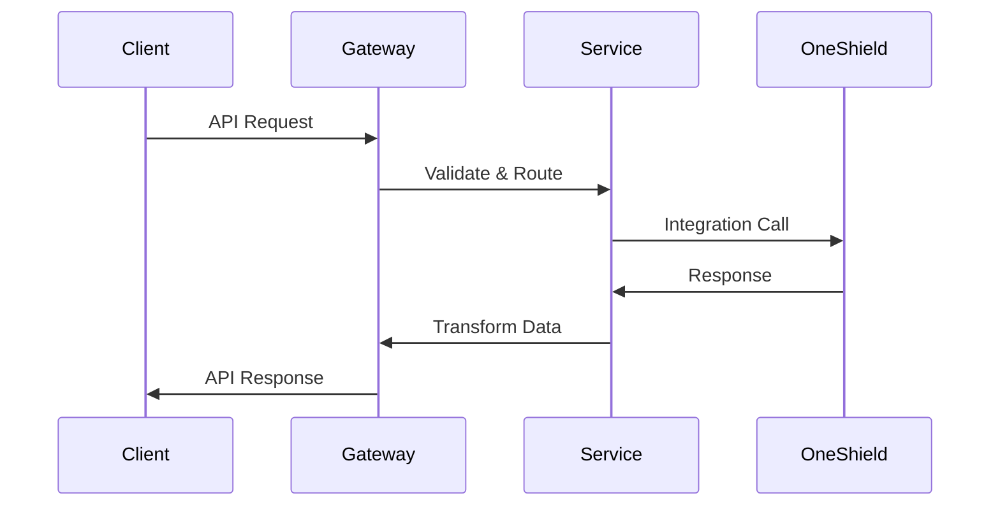

### 5.3.4 API Security

| Security Layer | Implementation |
|----------------|----------------|
| Authentication | - OAuth 2.0 with JWT<br>- API key validation<br>- Rate limiting per client |
| Authorization | - RBAC with custom claims<br>- Scope-based access<br>- Resource-level permissions |
| Data Protection | - TLS 1.3 encryption<br>- Request/response validation<br>- Payload size limits |

# 6. USER INTERFACE DESIGN

## 6.1 INTERFACE COMPONENTS KEY

```
NAVIGATION & ACTIONS          DATA ENTRY              STATUS & ALERTS
[#] Dashboard/Menu           [...] Text Input        [!] Warning/Error
[@] User Profile             [ ] Checkbox            [i] Information
[=] Settings                 ( ) Radio Button        [*] Required Field
[?] Help/Support            [v] Dropdown Menu        [====] Progress
[+] Add/Create              [^] File Upload         [$] Financial Data
[x] Close/Delete            [Search...] Search      [<][>] Pagination
```

## 6.2 PRIMARY LAYOUTS

### 6.2.1 Main Dashboard

```
+----------------------------------------------------------+
|  MGA OS [#]    [Search...]             [@] Admin  [?]     |
+----------------------------------------------------------+
|                                                           |
| +----------------+ +----------------+ +----------------+   |
| | New Policies   | | Underwriting   | | Claims         |  |
| | [====] 75%     | | [!] 12 Pending | | [i] 8 Active   |  |
| | 150/200 Target | | [$] $1.2M Vol  | | [$] $350k Est  |  |
| +----------------+ +----------------+ +----------------+   |
|                                                           |
| Recent Activity                        Quick Actions      |
| +-------------------------+ +--------------------------+  |
| | > Policy #12345 Updated | | [+] New Policy          |  |
| | > Risk Review Complete  | | [^] Upload Documents    |  |
| | > Claim #789 Filed     | | [$] Process Payment     |  |
| +-------------------------+ +--------------------------+  |
|                                                          |
+----------------------------------------------------------+
```

### 6.2.2 Policy Creation Wizard

```
+----------------------------------------------------------+
| New Policy                                    [x] Close    |
+----------------------------------------------------------+
| Progress: [====>    ] Step 2 of 5                         |
|                                                           |
| Policyholder Information                                  |
| +------------------------------------------------------+ |
| | Name [John Smith................] [*]                 | |
| | Type [v] Individual                                   | |
| | Email [.........................] [*]                 | |
| | Phone [.........................] [*]                 | |
| +------------------------------------------------------+ |
|                                                           |
| Coverage Details                                          |
| +------------------------------------------------------+ |
| | Product    [v] Commercial Property                    | |
| | Carrier    [v] OneShield Insurance                   | |
| | Term       ( ) 6 months  (•) 12 months               | |
| | Limits     [$] [........................]            | |
| +------------------------------------------------------+ |
|                                                           |
| [<< Back]                                    [Next >>]    |
+----------------------------------------------------------+
```

### 6.2.3 Underwriting Queue

```
+----------------------------------------------------------+
| Underwriting Queue                     Filter [v] All      |
+----------------------------------------------------------+
| +------------------------------------------------------+ |
| | Priority  Policy#   Type    Status   Actions          | |
| | [!] High  P-12345  Comm    Pending  [Review] [...]   | |
| | [*] Med   P-12346  Auto    Review   [View]   [...]   | |
| | [-] Low   P-12347  Home    New      [Start]  [...]   | |
| +------------------------------------------------------+ |
|                                                          |
| Risk Assessment                                          |
| +------------------------------------------------------+ |
| | Score: 85/100  [=====>     ]                         | |
| | Factors:                                             | |
| | [i] Claims History                                   | |
| | [!] Property Location                                | |
| | [i] Coverage Limits                                  | |
| +------------------------------------------------------+ |
|                                                          |
| [< Previous]  Page 1 of 5  [Next >]                     |
+----------------------------------------------------------+
```

## 6.3 RESPONSIVE DESIGN BREAKPOINTS

| Breakpoint | Target Devices | Layout Adjustments |
|------------|----------------|-------------------|
| 1920px+ | Large Desktop | Full dashboard with 4-column grid |
| 1440px | Desktop | 3-column grid, standard metrics |
| 1024px | Laptop/Tablet | 2-column grid, condensed metrics |
| 768px | Tablet/Mobile | Single column, stacked components |
| 360px | Mobile | Simplified views, essential data only |

## 6.4 INTERACTION PATTERNS

### 6.4.1 Navigation Flow

```
+------------------+     +------------------+     +------------------+
|    Dashboard     | --> | Policy Creation  | --> | Risk Assessment |
+------------------+     +------------------+     +------------------+
         |                       ^                        |
         v                       |                        v
+------------------+     +------------------+     +------------------+
| Document Upload  | --> |  Underwriting    | --> | Policy Binding  |
+------------------+     +------------------+     +------------------+
```

### 6.4.2 Modal Interactions

```
+----------------------------------------------------------+
| [!] Confirm Action                         [x]             |
+----------------------------------------------------------+
|                                                           |
| Are you sure you want to submit this policy for review?   |
|                                                           |
| [Cancel]                                    [Submit]      |
+----------------------------------------------------------+
```

## 6.5 ACCESSIBILITY REQUIREMENTS

| Feature | Implementation |
|---------|---------------|
| Color Contrast | WCAG 2.1 AA compliant (4.5:1 ratio) |
| Keyboard Navigation | Full support with visible focus states |
| Screen Readers | ARIA labels and landmarks throughout |
| Text Scaling | Supports 200% size increase |
| Error Handling | Clear visual and textual indicators |

## 6.6 THEME SPECIFICATIONS

| Element | Light Theme | Dark Theme |
|---------|------------|------------|
| Background | #FFFFFF | #1E1E1E |
| Primary Text | #333333 | #FFFFFF |
| Secondary Text | #666666 | #CCCCCC |
| Accent Color | #0066CC | #3399FF |
| Error States | #DC3545 | #FF4D4D |
| Success States | #28A745 | #33CC33 |
| Warning States | #FFC107 | #FFD700 |

# 7. SECURITY CONSIDERATIONS

## 7.1 AUTHENTICATION AND AUTHORIZATION

### 7.1.1 Authentication Methods

| Method | Implementation | Use Case |
|--------|---------------|-----------|
| OAuth 2.0 + OIDC | - Okta as Identity Provider<br>- JWT tokens with 1-hour expiry<br>- Refresh tokens with 24-hour lifetime<br>- MFA enforcement for all users | Primary authentication for web interface |
| Mutual TLS | - X.509 certificates<br>- Automated rotation every 90 days<br>- Certificate pinning<br>- Strong cipher suites (TLS 1.3) | Service-to-service communication with OneShield |
| API Keys | - SHA-256 hashed storage<br>- Automated rotation policy<br>- Rate limiting per key<br>- IP whitelisting | Third-party integrations |

### 7.1.2 Authorization Framework

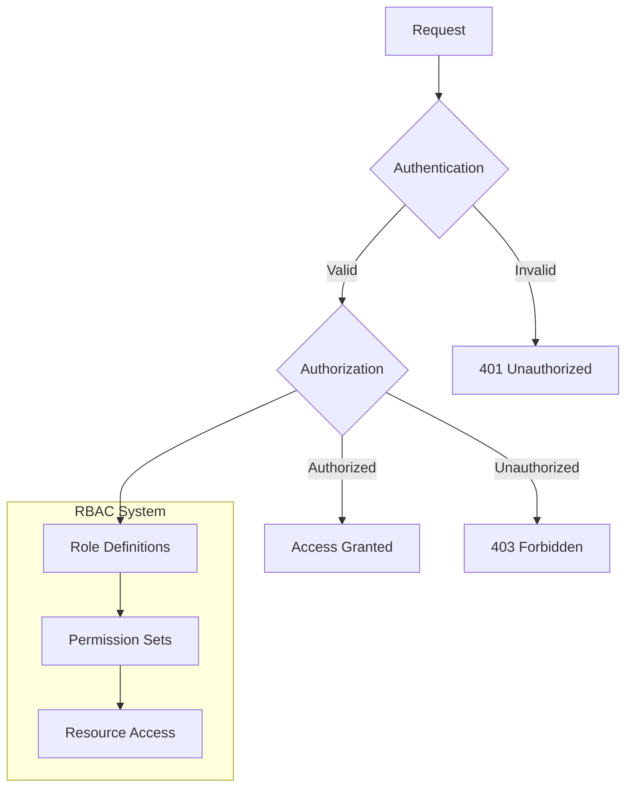

| Role | Permissions |
|------|------------|
| MGA Admin | - Full system access<br>- User management<br>- Configuration control |
| Underwriter | - Policy creation/modification<br>- Risk assessment<br>- Document access |
| Claims Handler | - Claims processing<br>- Document upload<br>- Payment approval |
| Auditor | - Read-only access<br>- Report generation<br>- Log viewing |

## 7.2 DATA SECURITY

### 7.2.1 Encryption Standards

| Data State | Method | Implementation |
|------------|--------|----------------|
| At Rest | - AES-256-GCM<br>- AWS KMS for key management<br>- Automated key rotation | - Database encryption<br>- Document storage<br>- Backup encryption |
| In Transit | - TLS 1.3<br>- Perfect Forward Secrecy<br>- Strong cipher suites | - API communications<br>- Service mesh traffic<br>- Client connections |
| In Process | - Memory encryption<br>- Secure key storage<br>- Hardware security modules | - Runtime protection<br>- Sensitive operations<br>- Key operations |

### 7.2.2 Data Classification

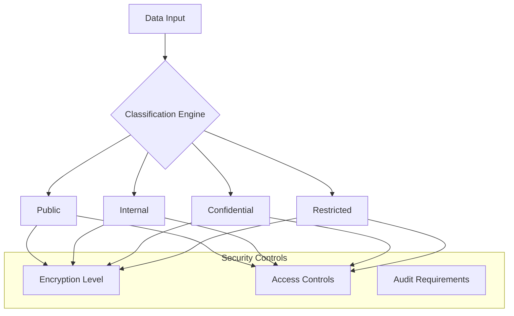

## 7.3 SECURITY PROTOCOLS

### 7.3.1 Security Monitoring

| Component | Implementation | Purpose |
|-----------|---------------|----------|
| WAF | AWS WAF with custom rules | - OWASP Top 10 protection<br>- DDoS mitigation<br>- Request filtering |
| SIEM | ELK Stack + Security Analytics | - Log aggregation<br>- Threat detection<br>- Security alerts |
| IDS/IPS | AWS GuardDuty + Custom Rules | - Network monitoring<br>- Threat prevention<br>- Anomaly detection |

### 7.3.2 Security Response Framework

```mermaid
stateDiagram-v2
    [*] --> Monitoring
    Monitoring --> Detection: Security Event
    Detection --> Analysis: Trigger Alert
    Analysis --> Response: Threat Confirmed
    Response --> Mitigation: Action Required
    Mitigation --> Recovery: Threat Contained
    Recovery --> Monitoring: System Restored
    Analysis --> Monitoring: False Positive
```

### 7.3.3 Compliance Controls

| Requirement | Implementation |
|-------------|---------------|
| SOC 2 Type II | - Continuous monitoring<br>- Access reviews<br>- Change management<br>- Incident response |
| GDPR/CCPA | - Data mapping<br>- Consent management<br>- Right to erasure<br>- Privacy controls |
| NAIC Security | - Data encryption<br>- Access controls<br>- Audit logging<br>- Incident reporting |
| PCI DSS | - Cardholder data security<br>- Network segmentation<br>- Vulnerability management<br>- Access control |

### 7.3.4 Security Testing

| Test Type | Frequency | Coverage |
|-----------|-----------|----------|
| Penetration Testing | Quarterly | - External interfaces<br>- API endpoints<br>- Authentication systems |
| Vulnerability Scanning | Weekly | - Infrastructure<br>- Dependencies<br>- Configuration |
| Security Reviews | Monthly | - Access controls<br>- Security configs<br>- Compliance checks |
| Code Analysis | Continuous | - SAST/DAST<br>- Dependency scanning<br>- Security gates |

# 8. INFRASTRUCTURE

## 8.1 DEPLOYMENT ENVIRONMENT

The MGA Operating System utilizes a cloud-native deployment model with multi-region availability.

| Environment | Purpose | Configuration |
|-------------|---------|---------------|
| Production | Live system serving all users | - Multi-region active-active deployment<br>- Auto-scaling enabled<br>- Full redundancy across availability zones<br>- Production-grade instances |
| Staging | Pre-production testing | - Single region deployment<br>- Limited auto-scaling<br>- Reduced redundancy<br>- Production-like instances |
| QA | Quality assurance testing | - Single availability zone<br>- Fixed instance count<br>- Development-grade instances |
| Development | Development and testing | - Local environment with minikube<br>- Docker Desktop integration<br>- Minimal resources |

## 8.2 CLOUD SERVICES

Primary cloud provider: AWS

```mermaid
graph TD
    A[AWS Cloud Infrastructure] --> B[Compute]
    A --> C[Storage]
    A --> D[Network]
    A --> E[Security]
    A --> F[Database]
    
    B --> B1[EKS]
    B --> B2[Lambda]
    B --> B3[EC2]
    
    C --> C1[S3]
    C --> C2[EBS]
    C --> C3[EFS]
    
    D --> D1[VPC]
    D --> D2[Route53]
    D --> D3[CloudFront]
    
    E --> E1[WAF]
    E --> E2[KMS]
    E --> E3[IAM]
    
    F --> F1[RDS]
    F --> F2[ElastiCache]
    F --> F3[DynamoDB]
```

| Service Category | AWS Services | Justification |
|-----------------|--------------|---------------|
| Compute | EKS, Lambda, EC2 | - Container orchestration<br>- Serverless processing<br>- Custom workloads |
| Storage | S3, EBS, EFS | - Document storage<br>- Database volumes<br>- Shared file systems |
| Database | RDS, ElastiCache, DynamoDB | - Relational data<br>- Caching layer<br>- NoSQL requirements |
| Networking | VPC, Route53, CloudFront | - Network isolation<br>- DNS management<br>- Content delivery |
| Security | WAF, KMS, IAM | - Application security<br>- Encryption management<br>- Access control |

## 8.3 CONTAINERIZATION

```mermaid
graph TD
    A[Container Architecture] --> B[Base Images]
    A --> C[Service Images]
    A --> D[Development Images]
    
    B --> B1[Java 17 Alpine]
    B --> B2[Python 3.11 Slim]
    B --> B3[Node 18 Alpine]
    
    C --> C1[Policy Service]
    C --> C2[Underwriting Service]
    C --> C3[Analytics Service]
    
    D --> D1[Dev Tools]
    D --> D2[Test Runners]
    D --> D3[Mock Services]
```

| Component | Implementation |
|-----------|---------------|
| Container Runtime | Docker 24.0+ |
| Base Images | - java:17-jdk-alpine<br>- python:3.11-slim<br>- node:18-alpine |
| Image Registry | Amazon ECR |
| Build Tools | Docker Buildkit |
| Security Scanning | Trivy, Snyk |

## 8.4 ORCHESTRATION

```mermaid
graph TD
    A[EKS Cluster] --> B[Control Plane]
    A --> C[Worker Nodes]
    
    B --> B1[API Server]
    B --> B2[etcd]
    B --> B3[Scheduler]
    
    C --> C1[Node Group 1]
    C --> C2[Node Group 2]
    C --> C3[Node Group 3]
    
    subgraph "Platform Services"
    D[Istio]
    E[Prometheus]
    F[Elastic Stack]
    end
    
    A --> D
    A --> E
    A --> F
```

| Component | Configuration |
|-----------|--------------|
| Kubernetes Version | 1.27+ |
| Node Types | - c5.xlarge for general workloads<br>- r6g.2xlarge for memory-intensive services<br>- m6g.large for balanced workloads |
| Service Mesh | Istio 1.18+ |
| Monitoring | Prometheus/Grafana |
| Logging | Elastic Stack |

## 8.5 CI/CD PIPELINE

```mermaid
flowchart LR
    A[Source Code] --> B{Build}
    B --> C{Test}
    C --> D{Security Scan}
    D --> E{Deploy to Staging}
    E --> F{Integration Tests}
    F --> G{Deploy to Prod}
    
    subgraph "Quality Gates"
    H[Code Coverage]
    I[Sonar Analysis]
    J[Vulnerability Scan]
    end
    
    C --> H
    C --> I
    D --> J
```

| Stage | Tools | Purpose |
|-------|-------|---------|
| Source Control | GitHub Enterprise | - Version control<br>- Code review<br>- Branch protection |
| CI Pipeline | Jenkins | - Automated builds<br>- Test execution<br>- Artifact generation |
| CD Pipeline | ArgoCD | - GitOps deployment<br>- Configuration management<br>- Rollback capability |
| Quality Gates | - SonarQube<br>- JUnit<br>- Trivy | - Code quality<br>- Test coverage<br>- Security compliance |
| Monitoring | - Datadog<br>- Grafana<br>- PagerDuty | - Performance monitoring<br>- Alert management<br>- On-call rotation |

# 9. APPENDICES

## 9.1 ADDITIONAL TECHNICAL INFORMATION

### 9.1.1 Infrastructure Monitoring Thresholds

| Metric | Warning Threshold | Critical Threshold | Action |
|--------|------------------|-------------------|---------|
| API Response Time | > 1.5 seconds | > 2 seconds | Auto-scale API instances |
| Database Connections | > 80% pool | > 90% pool | Increase connection pool |
| Kafka Lag | > 1000 messages | > 5000 messages | Scale consumer groups |
| Cache Hit Rate | < 85% | < 75% | Adjust cache policies |
| Queue Depth | > 1000 items | > 5000 items | Scale workers |

### 9.1.2 Disaster Recovery Tiers

```mermaid
flowchart TD
    A[System Components] --> B{Criticality Assessment}
    B --> C[Tier 1: Critical]
    B --> D[Tier 2: Important]
    B --> E[Tier 3: Non-Critical]
    
    C --> F[RTO < 4h, RPO < 15m]
    D --> G[RTO < 8h, RPO < 1h]
    E --> H[RTO < 24h, RPO < 24h]
    
    subgraph "Recovery Procedures"
    I[Active-Active]
    J[Active-Passive]
    K[Backup Restore]
    end
    
    F --> I
    G --> J
    H --> K
```

## 9.2 GLOSSARY

| Term | Definition |
|------|------------|
| Active-Active | High availability configuration where multiple nodes process requests simultaneously |
| Circuit Breaker | Design pattern that prevents cascading failures in distributed systems |
| Event Sourcing | Pattern of storing state changes as a sequence of events |
| Feature Flag | Configuration mechanism to enable/disable functionality dynamically |
| Idempotency | Property where multiple identical requests produce the same result |
| Rate Limiting | Controlling the number of requests a client can make in a given timeframe |
| Service Mesh | Infrastructure layer handling service-to-service communication |
| Webhook | HTTP callback that occurs when a specific event happens |

## 9.3 ACRONYMS

| Acronym | Full Form |
|---------|-----------|
| ABAC | Attribute-Based Access Control |
| APM | Application Performance Monitoring |
| CDN | Content Delivery Network |
| CI/CD | Continuous Integration/Continuous Deployment |
| ELK | Elasticsearch, Logstash, Kibana |
| IOPS | Input/Output Operations Per Second |
| JWT | JSON Web Token |
| KMS | Key Management Service |
| OIDC | OpenID Connect |
| RDS | Relational Database Service |
| SLA | Service Level Agreement |
| SLO | Service Level Objective |
| TLS | Transport Layer Security |
| VPC | Virtual Private Cloud |
| WAF | Web Application Firewall |
| XSS | Cross-Site Scripting |

### 9.3.1 Insurance-Specific Acronyms

| Acronym | Full Form |
|---------|-----------|
| ACORD | Association for Cooperative Operations Research and Development |
| DOI | Department of Insurance |
| FNOL | First Notice of Loss |
| MGA | Managing General Agent |
| NAIC | National Association of Insurance Commissioners |
| P&C | Property and Casualty |
| UW | Underwriting |

## 9.4 REFERENCE ARCHITECTURE

```mermaid
flowchart TD
    A[Client Applications] --> B{API Gateway}
    B --> C[Auth Service]
    B --> D[Service Mesh]
    
    D --> E[Core Services]
    D --> F[Support Services]
    
    subgraph "Core Services"
    E1[Policy Service]
    E2[Underwriting Service]
    E3[Claims Service]
    end
    
    subgraph "Support Services"
    F1[Document Service]
    F2[Notification Service]
    F3[Analytics Service]
    end
    
    subgraph "Data Layer"
    G[Primary DB]
    H[Cache]
    I[Event Store]
    end
    
    E --> G
    E --> H
    E --> I
    F --> G
    F --> H
    F --> I
```